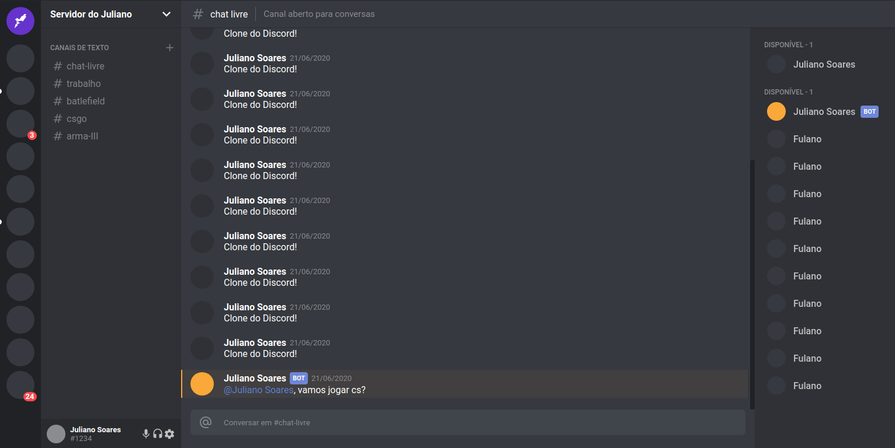

<h1 align="center">
UI Clone - Discord
</h1>

Responsive Discord UI clone for study purposes.

Click <a href="https://youthful-davinci-114e36.netlify.app/">here</a> to live preview.

  
  

  <a href="#rocket-tecnologias">Tecnologias</a>&nbsp;&nbsp;&nbsp;|&nbsp;&nbsp;&nbsp;
  <a href="#computer-projeto">Projeto</a>&nbsp;&nbsp;&nbsp;

 
<h3>Imagens:<h3>

  

  
## :rocket: Tecnologias
- ReactJS

## :computer: Projeto
> Projeto feito a partir do vídeo da canal da Rocketseat.
